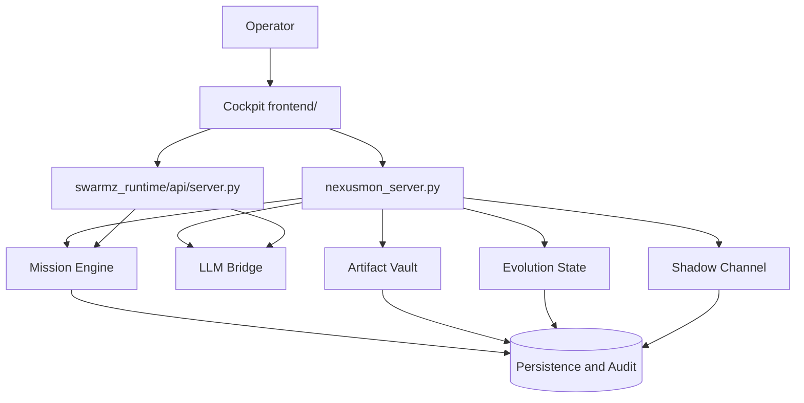

<div align="center">

# ✦✸⚚⬡◎⟐

# NEXUSMON

**Governed AI Mission Runtime · Truthful Cockpit · Sovereign Operator Control**

> *You are not deploying software.*
>
> *You are awakening an organism.*

</div>

---

## What It Is

NEXUSMON is a governed AI mission runtime wrapped in a cockpit-grade operator interface.

It began as **SWARMZ**: a multi-agent execution kernel built for structured mission routing, persistence, and auditability. It evolved into **NEXUSMON** when that kernel grew a control deck, an artifact memory, a companion layer, and a doctrine centered on operator sovereignty.

It is not a dashboard.

It is not a wrapper.

It is not a concept demo.

It is a control plane for AI operations built around one non-negotiable law:

> **If it glows on screen, it should have a wire behind it.**

---

## Instant Proof

The fastest way to evaluate NEXUSMON is not to read lore. It is to check whether the machine has real surfaces behind the voice.

### What is already true

- primary backend: `nexusmon_server.py`
- mirrored runtime: `swarmz_runtime/api/server.py`
- active cockpit: `frontend/`
- validated local test state: `1689 passed, 1 skipped`
- canonical branch: `main`

### Quickstart in 60 Seconds

```bash
pip install -r requirements-dev.txt
python nexusmon_server.py
cd frontend && npm install && npm run dev
```

Then open the frontend, inspect the runtime surfaces, and compare what the cockpit shows against the backend-backed state described in [docs/TECHNICAL_OVERVIEW.md](docs/TECHNICAL_OVERVIEW.md).

If you want the engineering proof layer first, start with [docs/TECHNICAL_OVERVIEW.md](docs/TECHNICAL_OVERVIEW.md) instead of this README.

---

## Lineage

```text
SWARMZ  --------------------------------------------->  NEXUSMON
execution kernel                                        governed organism-runtime
infrastructure first                                    operator-facing control plane
no cockpit                                              truthful cockpit migration
no evolution framing                                    XP, rank, and form state
mission routing proof                                   mission-bearing runtime
```

SWARMZ asked whether agents could be coordinated under a governed mission loop.

NEXUSMON answers yes, and keeps the operator in command.

Compatibility shims remain where migration safety still requires them, but the living line is now NEXUSMON.

---

## Current Validated State

The verified present state is stronger than the aesthetic around it.

- Backend: real mission execution, provider routing, reversible snapshots, artifact persistence, audit streaming, evolution state, companion modes, and guardrail validation.
- Cockpit: real health, XP, and audit wiring are live; additional panels are still migrating from placeholder state to backend truth.
- Validation: local full-suite result is **1689 passed, 1 skipped** on 2026-03-07.
- Branch policy: [main](docs/status/branch_normalization_complete_2026-03-07.md) is the canonical line; `master` remains legacy.

The backend is real.

The cockpit is increasingly real.

Some surfaces are finished. Some are still wiring.

For the exact validation snapshot, see [docs/status/local_validation_2026-03-07.md](docs/status/local_validation_2026-03-07.md).

---

## The Organism

NEXUSMON is not a pile of disconnected services. It is one runtime with distinct systems.



| System | Role |
|------|------|
| Runtime Kernel | Mission intake, validation, execution, persistence |
| LLM Bridge | Multi-provider routing, budget gate, cache, circuit breaker |
| Mission Engine | `create -> validate -> execute -> persist` |
| Evolution Engine | XP, rank, form progression, persisted organism state |
| Artifact Vault | Versioned operator-facing outputs |
| Shadow Channel | Append-only audit memory and SSE-visible truth |
| PolicyGate | PASS, ESCALATE, QUARANTINE, DENY governance decisions |
| Companion Voice | Strategic, Combat, Guardian modes |
| Cockpit | The operator surface: legible, wired, increasingly truthful |

The purpose of the cockpit is not decoration.

Its purpose is to make runtime state legible under pressure.

---

## Worker Forms

Three worker forms are part of the runtime and routing layer. Each has a role. Each has a boundary.

### BYTEWOLF

Pathfinder · Analysis · Intelligence

Reads terrain, inspects unknown systems, and returns operator-useful truth.

### GLITCHRA

Anomaly · Transform · Edge

Finds fractures, tests assumptions, and reshapes unstable matter into something usable.

### SIGILDRON

Artifact Courier · Seal · Delivery

Signs, seals, and delivers operator-grade work without losing integrity on the way out.

These forms are symbolic, but they are grounded in concrete worker roles in the runtime.

---

## What Makes It Different

Most AI tooling fails in one of two ways:

- it hides execution behind abstraction
- it fakes liveness with polished UI

NEXUSMON is built around a harder standard.

- actions should be governable
- runtime state should be visible
- outputs should be persistent
- autonomy should stay bounded
- operator control should remain intact

Truth beats theatre.

Audit beats aura.

The cockpit must tell the truth.

---

## Why Believe It

NEXUSMON earns credibility from implementation detail, not from aesthetic intensity.

- the backend path is real: mission execution, routing, persistence, audit, and evolution state are implemented and validated
- the repo exposes the active surfaces directly instead of hiding them behind marketing abstractions
- the public README now links straight to the current proof layer, migration plan, and validation snapshot
- the remaining unfinished areas are named as migration work, not disguised as completed autonomy

---

## Repository Map

The repo is historically dense, but the active surfaces are clear.

| Path | Role |
|------|------|
| `nexusmon_server.py` | Primary FastAPI application surface |
| `swarmz_runtime/api/server.py` | Mirrored runtime/kernel server surface |
| `core/` | Shared governance, manifests, orchestration, canonical backend logic |
| `swarmz_runtime/` | Runtime engine, bridge, storage, API routers |
| `frontend/` | Active React + Vite cockpit |
| `cockpit/` | Legacy Preact cockpit surface |
| `.github/agents/` | Custom agent manifests and guardrail entry points |
| `tests/` | Validated system coverage |
| `docs/` | Doctrine, layout, migration, and status records |

Start here:

- [docs/repository_layout.md](docs/repository_layout.md)
- [docs/TECHNICAL_OVERVIEW.md](docs/TECHNICAL_OVERVIEW.md)
- [docs/truthful_migration_playbook.md](docs/truthful_migration_playbook.md)
- [docs/DOCTRINE.md](docs/DOCTRINE.md)
- [docs/status/local_validation_2026-03-07.md](docs/status/local_validation_2026-03-07.md)

---

## Running Locally

```bash
# Install Python dependencies
pip install -r requirements-dev.txt

# Start the primary server
python nexusmon_server.py

# Start the mirrored runtime server
python -m swarmz_runtime.api.server

# Start the active cockpit
cd frontend && npm install && npm run dev

# Optional legacy cockpit surface
cd cockpit && npm install && npm run dev

# Run tests
pytest tests/ --tb=short -q
```

---

## Horizon

NEXUSMON is not finished. It is consolidating.

Near-term work is about forcing the shell and the runtime into the same truthful body.

- finish live wiring for the remaining cockpit panels
- continue intentional `swarmz` to `nexusmon` normalization
- expand characterization around non-mission paths
- push provider intelligence, routing visibility, and supply-network awareness forward without overstating them as done

Longer-horizon work points toward a broader operator platform: stronger governance, deeper runtime visibility, ecosystem-aware routing, and eventually federated coordination across sovereign nodes.

For the strategic roadmap, see [docs/ROADMAP.md](docs/ROADMAP.md).

---

## Sovereign Operator

**Regan Harris**

Creator · Architect · Operator

---

## License

Proprietary. Copyright © 2026 Regan Harris. All rights reserved.

See [LICENSE](LICENSE) for full terms.

---

<div align="center">

✦✸⚚⬡◎⟐

**NEXUSMON · 2026**

**The cockpit must tell the truth.**

**Alive where the state is real.**

</div>
